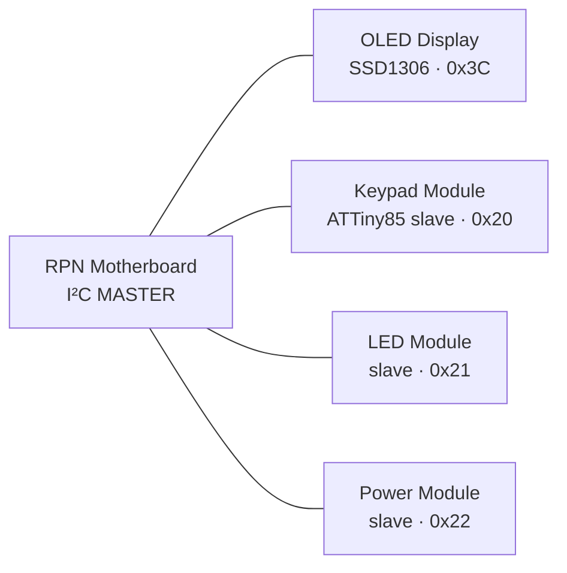

# attiny-rpn-calc

An **RPN calculator built on ATTiny85s** — and, more interestingly, the
**modular Qwiic / I²C ecosystem** that fell out of building it.

What started as "put an RPN calculator on a '85" turned into a platform: instead
of one chip driving a keypad, a display and some LEDs, **each capability is its
own small, cheap, single-purpose I²C module**, and every module speaks the same
register convention. The calculator is just the first host on the bus.

> **Status: design phase.** This repo currently holds the architecture, a solved
> keypad-ladder design, and the tool that produced it. No firmware or PCBs yet —
> see [Roadmap](#roadmap).

---

## The idea



One shared 4-wire bus (`SDA`/`SCL`/`VCC`/`GND`) over **Qwiic / STEMMA QT**
connectors. Each module owns its own pins, its own analog mess, its own driver
complexity — and hides all of it behind a handful of I²C registers. The host
never learns how keys are scanned or how the LEDs are wired; it reads and writes
registers.

Because the connector standard is Qwiic, every module you build also plugs into
the wider Qwiic ecosystem — and every off-the-shelf Qwiic sensor plugs into
yours.

### Module catalog

| Module | Role | Brain | Addr |
|---|---|---|---|
| RPN Motherboard | I²C master, RPN logic, display formatting | ATTiny85 (or tinyAVR-1) | — |
| Keypad Module | 16 keys → events, sticky modifiers, status LEDs | ATTiny85 slave | `0x20` |
| LED Module | Expressive light output | LED driver IC *or* ATTiny85 slave | `0x21` |
| Power Module | LiPo telemetry, charge state, rail control | ATTiny85 slave (optional) | `0x22` |
| OLED Display | Numeric / stack display | SSD1306 (off-the-shelf) | `0x3C` |

Every module implements the same **common header** (`WHO_AM_I`, `VERSION`,
`STATUS`, `CONFIG`, `I2C_ADDR`) so hosts can identify and configure any module
uniformly, with module-specific registers starting at `0x10`. Addresses live in
EEPROM and are writable over the bus, so two identical keypads can share a bus.

## The fun part: 16 keys on one ADC pin

The '85 has six I/O pins and two of them are the I²C bus — so a 4×4 matrix scan
is out of the question. Instead the keypad module decodes all 16 keys on **one
ADC pin** using a base-4 positional resistor ladder:

```
VCC ──┬─[Rr0]── Row1        SENSE ──┬─[Rc0]── Col1
      ├─[Rr1]── Row2                ├─[Rc1]── Col2
      ├─[Rr2]── Row3                ├─[Rc2]── Col3
      └─[Rr3]── Row4                └─[Rc3]── Col4
                              SENSE ──[Rload]── GND ──► ADC (PB3)
```

Pressing key *(row i, col j)* closes exactly one path, so
`R_total = Rr_i + Rc_j` — and with base-4 spacing that resistance **is** the
keycode. The divider is ratiometric, so the thresholds are identical at 3.3 V or
5 V.

The catch is that the divider is nonlinear and real resistors come from the E24
grid, so there's no closed form. [`modules/smartiny-key/tools/ladder_optimizer.py`](modules/smartiny-key/tools/ladder_optimizer.py)
searches for the 8 values (+ `Rload`) that **maximize the minimum ADC gap**
between adjacent keycodes, subject to two hard constraints: monotonic decode,
and — the interesting one — the *dimmest* press must still cross the PCINT
digital-HIGH threshold, so **the same wire that decodes the key also wakes the
sleeping MCU**.

Locked result: **14-count minimum gap** with a **12-count wake margin**. Values,
full decode table, thresholds and C decode function are in
[`modules/smartiny-key/docs/ladder.md`](modules/smartiny-key/docs/ladder.md).

```console
$ python3 modules/smartiny-key/tools/ladder_optimizer.py     # fixed seed → reproducible
```

## Design commitments

- **3.3 V bus, single LiPo.** 3.3 V is native to Qwiic/STEMMA QT and a LiPo
  regulates to it efficiently across its whole discharge curve. Boards are
  designed voltage-agnostic (3.0–5.5 V parts, '85 at 8 MHz internal RC) so a 5 V
  bench PoC migrates without a respin.
- **Sleep is the architecture, not an optimization.** Always-on LEDs give ~6 h on
  a 500 mAh cell; dim, event-driven light with sleeping MCUs gives ~500 h. That
  ~100× gap drives the keypad wake design, the OLED display-off policy, and the
  choice of state-latching APA102/SK9822 over WS2812.
- **One shared open-drain `INT` line, not an interrupt bus.** An I²C slave can't
  wake a sleeping master, so a single wired-OR attention wire (5th pin on your own
  backplane; plain Qwiic devices still just get polled) is what makes real
  deep-sleep wake possible.
- **Testable core.** Each module splits into `*-core` (pure C — debounce, event
  FIFO, modifier state machine; **unit-tested on a PC**), `platform` (thin HAL per
  chip), and `i2c-register` (register table → TinyWireS callbacks). Debug the
  logic with tests, not a scope.
- **Exactly one set of bus pull-ups, on the master.** And never run an LED strip's
  amps through the Qwiic `VCC` line — that's the most common way this fails.

## Roadmap

Product priority and learning priority deliberately differ — the keypad is the
flagship, but the LED module gets built first because it's the simplest
*complete* vertical slice of the architecture, and becomes the reference-slave
template everything else forks.

| # | Board | Purpose |
|---|---|---|
| 0 | **LED module** | Learning PCB + reference I²C slave skeleton |
| 1 | **Keypad module** | Flagship input: ADC ladder + debounce + FIFO + modifiers |
| 2 | **Motherboard** | RPN brain + off-the-shelf SSD1306 |
| 3 | **FRAM + programmable RPN** | User programs / NV state (`0x50` + program VM) |
| — | USB, OLED co-processor, backplane mux | Later |

## Repo layout

```
docs/bench-setup.md      shared tooling + consumables (programmer, caps, analyzer)
docs/research/           chip-choice and component investigations
docs/architecture.md     the platform: bus rules, register model, power/sleep/
                         interrupt architecture, chip choices, open decisions
lib/                     shared libraries
  smartiny-common/       register model — the bus contract (smartiny_regs.h)
  smartiny-slave/        I²C slave engine: register dispatch, EEPROM address
  smartiny-hal/          per-chip HAL (attiny85 / tinyavr / host-for-tests)
modules/                 the smartiny board family — see modules/README.md
  smartiny-key/          16-key keypad → events        0x20   in progress
  smartiny-led/          indicator / light output      0x21   next (Board 0)
  smartiny-pwr/          LiPo telemetry, charge state  0x22   planned
  smartiny-mem/          NV store for user programs    0x50   planned
  smartiny-calc/         RPN brain — bus master        —      planned
tools/                   cross-cutting dev tools
```

Modules are named **`smartiny-<role>`** and each follows the same shape
(`docs/ hardware/ firmware/core/ tests/ tools/`), created as it fills. Every
module hides its pins and driver complexity behind the shared register model in
[`lib/smartiny-common/smartiny_regs.h`](lib/smartiny-common/smartiny_regs.h).

Start with [`docs/architecture.md`](docs/architecture.md) — §11 lists the
decisions still open (power module smart vs dumb, `INT` line vs strict Qwiic-4,
motherboard chip, modifier semantics, the USB story).
