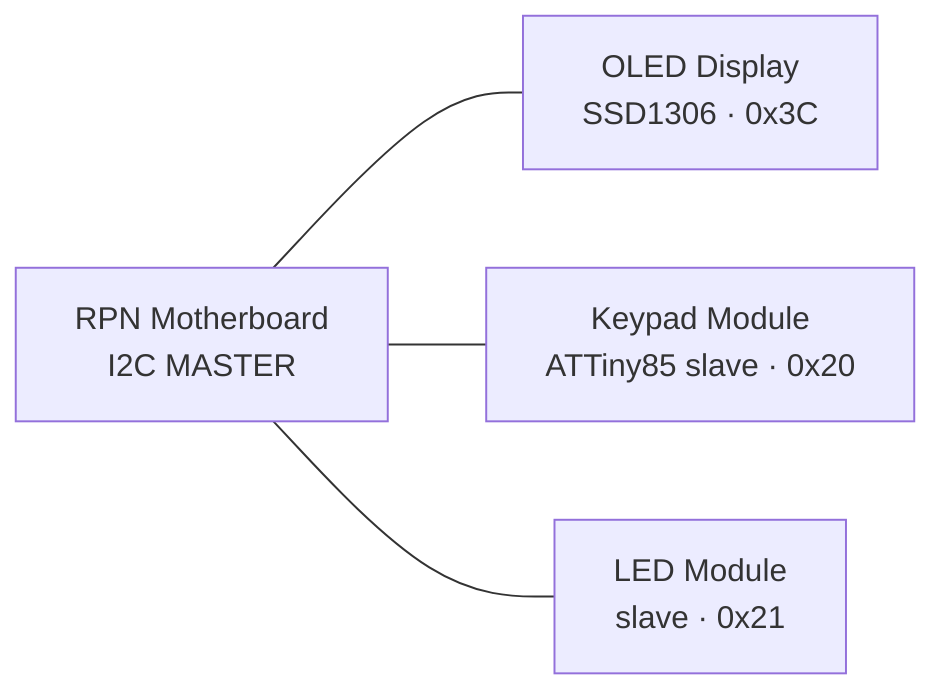

# Modular I2C Keypad / Display Platform — Architecture

> A pluggable I2C ecosystem born from an ATTiny85 RPN calculator. Each function
> (input, display, indication) is a self-contained I2C module behind a common
> register interface, so any host can compose them.

## 1. Vision

What started as an RPN calculator on an ATTiny85 became a **platform**: a shared
I2C bus where each capability is its own small, cheap, single-purpose module.
The RPN calculator is just the *first host* — the reusable primitive is the set
of modules and the register convention they speak.

Design north star: **each module owns its own pins and driver complexity, and
hides all of it behind a small I2C register interface.** The host never learns
how the LEDs are wired or how keys are scanned — it reads and writes registers.

## 2. System architecture



All devices share **one** 4-wire bus: `SDA`, `SCL`, `VCC`, `GND`. This is a
multi-drop bus, **not** a daisy-chain — every device taps the same two signal
lines in parallel and is distinguished only by its 7-bit address. (Qwiic /
STEMMA QT connectors make it *physically* chainable via pass-through connectors,
even though electrically it is a shared bus.)

### Module catalog

| Module | Role | Brain | Default addr |
|---|---|---|---|
| RPN Motherboard | I2C **master**, RPN logic, display formatting | ATTiny85 (or tinyAVR-1) | — (master) |
| Keypad Module | 16 keys → events, sticky modifiers, local status LEDs | ATTiny85 slave | `0x20` |
| LED Module | Expressive light output | I2C LED-driver IC **or** ATTiny85 slave | `0x21` |
| OLED Display | Numeric / stack display | SSD1306 (off-the-shelf) | `0x3C` (fixed) |

## 3. Bus design & rules

These are the practical rules that keep a multi-module bus reliable.

1. **Addresses must not collide.** The OLED is fixed at `0x3C`/`0x3D`; keep your
   own modules clear of it. Because ATTiny85 modules have no strap pins, each
   module stores its address in **EEPROM**, settable via the `I2C_ADDR` register
   (§5). This lets two identical keypads coexist on one bus.
2. **Pull-ups: exactly ONE set, on the master/motherboard.** Do **not** populate
   SDA/SCL pull-ups on every module — parallel pull-ups drag the bus low and it
   stops working. Master carries them (e.g. 4.7 kΩ at 100 kHz); slaves do not.
3. **Common ground, careful power.** All modules share `GND`. **An LED strip can
   draw amps — never feed it through the thin Qwiic `VCC` line.** Give the LED
   module its own power injection; only signal (and light logic VCC) rides the
   connector. This is the most common failure.
4. **Bus speed.** Default to **100 kHz** (standard mode) for reliability over
   chained cables and mixed devices. Move to 400 kHz only if every device and
   the cabling support it.
5. **Keypad notification = polling.** A shared I2C bus gives a slave no way to
   interrupt the master. The motherboard **polls** the keypad at ~50–100 Hz
   (invisible to humans, dead simple). An optional out-of-band `INT` wire is
   possible but unnecessary for a keypad.

### Connector standard

Adopt **Qwiic / STEMMA QT** (4-pin JST-SH: SDA/SCL/VCC/GND). Each module carries
two connectors to pass the bus through, giving plug-and-chain assembly and
compatibility with the wider Qwiic ecosystem.

## 4. Firmware architecture (shared)

Layer every module so the interesting logic is MCU-independent and testable on a
PC:

- **`*-core`** — pure C, no hardware. Debounce, key binning, event FIFO,
  modifier state machine, LED pattern logic. **Compiles and unit-tests on the
  host.**
- **`platform`** — thin HAL: ADC read, GPIO, timers. One file per chip
  (`platform_attiny85.c`, `platform_tinyavr.c`).
- **`i2c-register`** — maps the register table (§5) onto TinyWireS slave
  callbacks (or hardware TWI on tinyAVR).

This split is what makes the "bare-bones attiny lib" reusable across the ATTiny85
and the tinyAVR/megaAVR-0, and lets you debug debounce / modifier logic with real
tests instead of a scope.

## 5. Shared register-model convention

Every module implements the same **common header** so hosts can identify and
configure any module uniformly. Module-specific registers start at `0x10`.

### Common header (all modules)

| Reg | Name | Access | Meaning |
|---|---|---|---|
| `0x00` | `WHO_AM_I` | R | Device family/type id |
| `0x01` | `VERSION` | R | FW version, packed `major.minor` |
| `0x02` | `STATUS` | R | Generic status bits |
| `0x03` | `CONFIG` | R/W | Generic config bits |
| `0x04` | `I2C_ADDR` | R/W | Stored 7-bit address (persists to EEPROM) |

### Keypad module (from `0x10`)

| Reg | Name | Access | Meaning |
|---|---|---|---|
| `0x10` | `KEY_STATUS` | R | `[events_pending][fifo_ovf][mod_active]…` |
| `0x11` | `MODIFIERS` | R | Current sticky/latch bitmask |
| `0x12` | `EVENT_FIFO` | R | Read pops one event byte (below) |
| `0x13` | `EVENT_COUNT` | R | Queued events |
| `0x14` | `DEBOUNCE_MS` | R/W | Debounce window |
| `0x15` | `REPEAT_CFG` | R/W | Key-repeat enable/rate |
| `0x16` | `LED_LOCAL` | R/W | 1–2 local status LEDs (modifier indication) |

**Event byte format** (`EVENT_FIFO`): `[type:1][mod_snapshot:3][keycode:4]`
- `keycode` 0–15 — which key
- `mod_snapshot` — modifier latch state *at the moment of the event*
- `type` — press vs release

The **FIFO decouples host polling from keypad scan timing**: host reads
`KEY_STATUS`, and if events are pending, drains `EVENT_FIFO`. Each event carries
its modifier context so the host always knows how a key was pressed.

### LED module (from `0x10`)

| Reg | Name | Access | Meaning |
|---|---|---|---|
| `0x10` | `LED_COUNT` | R | Number of LEDs present |
| `0x11` | `GLOBAL_BRIGHT` | R/W | Master brightness |
| `0x12…` | `LEDn_RGB` | R/W | Per-LED color (3 bytes) — re-clocks the strip |
| `0x1F` | `PATTERN` | R/W | Play a built-in pattern (smart module only) |

## 6. Keypad module — deep dive

### 6.1 Single-ADC base-4 matrix decode

A passive 4×4 matrix module (16 buttons, 8 leads, no controller) is decoded on
**one** ADC pin using a base-4 positional resistor ladder:

```
VCC ──┬─[ 0·R]── Row1        SENSE ──┬─[0·R]── Col1
      ├─[ 4·R]── Row2                ├─[1·R]── Col2
      ├─[ 8·R]── Row3                ├─[2·R]── Col3
      └─[12·R]── Row4                └─[3·R]── Col4
                                SENSE ──[Rload]── GND
                                SENSE ─────────────► ADC (PB3)
```

Pressing key `(row i, col j)` closes the only path:
`VCC → Rr_i → [row↔col short] → Rc_j → SENSE → Rload → GND`, so the series
resistance is:

```
R_total = Rr_i + Rc_j = (4·i + j)·R = keycode·R      (keycode 0–15)
V_sense = VCC · Rload / (keycode·R + Rload)
```

The total resistance **is** the keycode × R — every button maps to a unique
voltage. Idle (no press) reads 0 via `Rload`, cleanly distinct from all keys.

**Design notes / gotchas**
- **Nonlinear spacing** — V is monotonic in keycode but compressed at high codes
  (14↔15 is tightest). Tune `Rload` and, if needed, nudge values off perfect
  base-4 ratios to equalize *voltage* steps. *(TODO: run E24 optimizer to
  maximize the minimum voltage gap; publish the 16 thresholds + margins.)*
- **Unit R ≈ 1–2 kΩ** so tactile-switch contact resistance (~10–50 Ω) is <0.3%
  error. Don't go small.
- **ADC source impedance** at high codes is tens of kΩ — add **~10 nF at SENSE**,
  slow the ADC clock, and require N consecutive stable reads (debounce does this).
- **Single-key only** — two presses create two paths and a garbage voltage. The
  **latched/sticky modifiers make this a non-issue**: the user never physically
  holds two keys, so no chording is ever required.

### 6.2 Pin map (ATTiny85)

| Pin | Function |
|---|---|
| PB0 | SDA (USI) |
| PB2 | SCL (USI) |
| PB3 | ADC sense (base-4 matrix decode) |
| PB1 | Local status LED (modifier indicator) |
| PB4 | Local status LED (modifier indicator) |
| PB5 | RESET (leave as reset for easy reflashing) |

### 6.3 Sticky / function-key state machine

Function keys are configurable and support three behaviors:
- **Momentary** — active only while held.
- **Sticky / one-shot** — latches, applies to the *next* key, then auto-clears.
- **Lock** — toggles until pressed again (caps-lock style).

Modifier state lives in the keypad module and is reported with every key event
(the `mod_snapshot`). Local status LEDs (`LED_LOCAL`) show which modifiers are
currently latched — the state lives here, so it is indicated here.

## 7. LED module — options

Two flavors, both hidden behind the same register interface:

- **Dumb driver IC** — a PCA9685 (16-ch PWM), TLC59108, or IS31FL3731 (matrix)
  *is* an I2C slave already. No firmware, no second MCU; the motherboard writes
  brightness registers directly. Cheapest.
- **Smart module (own ATTiny85/tinyAVR)** — worth it only for local behavior
  (animations, idle "breathe", sequences) so the host says "play pattern 3"
  instead of streaming frames.

**Addressable LEDs (APA102 / SK9822)** are the recommended light source for a
smart module: **clocked** protocol (2 pins, data+clock), so it can be bit-banged
slowly *without disabling interrupts* — it never fights USI I2C timing, unlike
WS2812's strict 800 kHz. They also latch their own state (**fire-and-forget**, no
refresh loop competing with I2C/keypad scan) and give per-LED RGB + brightness.

## 8. Chip-choice guidance

- **Slave modules** (keypad, smart LED) — the **ATTiny85** is in its element:
  one chip, one job. USI provides I2C slave via TinyWireS.
- **Motherboard / master** — a bare '85 masters I2C fine (USI-TWI master) and is
  plenty for an *event-driven* calculator display. Step up to a **tinyAVR-1 /
  megaAVR-0** only if you want hardware TWI, more flash/RAM for the RPN stack, and
  a `INT`-capable pin — and note **UPDI** programming keeps every I/O pin usable
  and reprogrammable.
- **I2C bus-controller bridge** (e.g. NXP **SC18IM704** UART↔I2C master) exists to
  offload mastering from the '85, but if you're adding a helper chip anyway, a
  tinyAVR with hardware TWI is the cleaner "still an AVR" choice.

## 9. Open decisions

1. Motherboard chip: bare ATTiny85 (purist) vs tinyAVR-1 (headroom)?
2. LED module: dumb driver IC vs smart ATTiny85 + APA102?
3. Modifier semantics: are the status lights one-at-a-time modes or stackable
   flags? (Drives local-LED scheme: one-hot decoder vs independent/APA102.)
4. Run the resistor-ladder optimizer and lock the 16 ADC thresholds + margins.
5. Assign the `WHO_AM_I` device-type id space.
