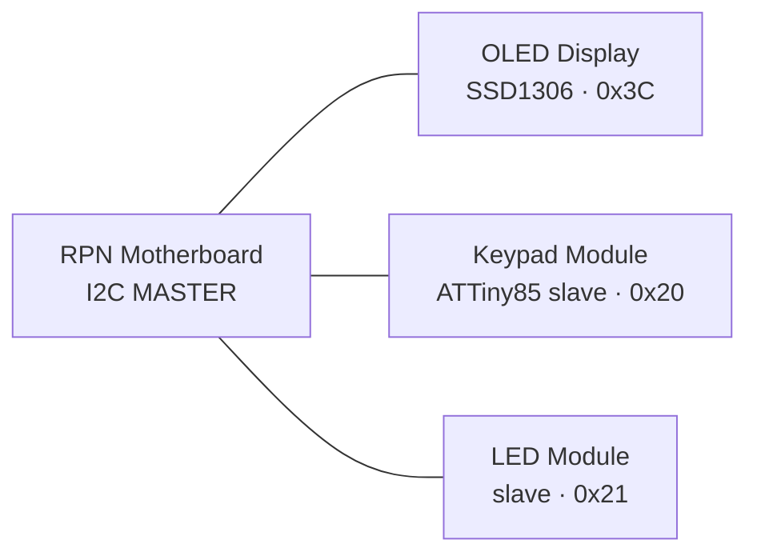

# Modular I2C Keypad / Display Platform — Architecture

> A pluggable I2C ecosystem born from an ATTiny85 RPN calculator. Each function
> (input, display, indication) is a self-contained I2C module behind a common
> register interface, so any host can compose them.

## 1. Vision

What started as an RPN calculator on an ATTiny85 became a **platform**: a shared
I2C bus where each capability is its own small, cheap, single-purpose module.
The RPN calculator is just the *first host* — the reusable primitive is the set
of modules and the register convention they speak.

Design north star: **each module owns its own pins and driver complexity, and
hides all of it behind a small I2C register interface.** The host never learns
how the LEDs are wired or how keys are scanned — it reads and writes registers.

## 2. System architecture



All devices share **one** 4-wire bus: `SDA`, `SCL`, `VCC`, `GND`. This is a
multi-drop bus, **not** a daisy-chain — every device taps the same two signal
lines in parallel and is distinguished only by its 7-bit address. (Qwiic /
STEMMA QT connectors make it *physically* chainable via pass-through connectors,
even though electrically it is a shared bus.)

### Module catalog

| Module | Role | Brain | Default addr |
|---|---|---|---|
| RPN Motherboard | I2C **master**, RPN logic, display formatting | ATTiny85 (or tinyAVR-1) | — (master) |
| Keypad Module | 16 keys → events, sticky modifiers, local status LEDs | ATTiny85 slave | `0x20` |
| LED Module | Expressive light output | I2C LED-driver IC **or** ATTiny85 slave | `0x21` |
| OLED Display | Numeric / stack display | SSD1306 (off-the-shelf) | `0x3C` (fixed) |

## 3. Bus design & rules

These are the practical rules that keep a multi-module bus reliable.

1. **Addresses must not collide.** The OLED is fixed at `0x3C`/`0x3D`; keep your
   own modules clear of it. Because ATTiny85 modules have no strap pins, each
   module stores its address in **EEPROM**, settable via the `I2C_ADDR` register
   (§5). This lets two identical keypads coexist on one bus.
2. **Pull-ups: exactly ONE set, on the master/motherboard.** Do **not** populate
   SDA/SCL pull-ups on every module — parallel pull-ups drag the bus low and it
   stops working. Master carries them (e.g. 4.7 kΩ at 100 kHz); slaves do not.
3. **Common ground, careful power.** All modules share `GND`. **An LED strip can
   draw amps — never feed it through the thin Qwiic `VCC` line.** Give the LED
   module its own power injection; only signal (and light logic VCC) rides the
   connector. This is the most common failure.
4. **Bus speed.** Default to **100 kHz** (standard mode) for reliability over
   chained cables and mixed devices. Move to 400 kHz only if every device and
   the cabling support it.
5. **Keypad notification = polling.** A shared I2C bus gives a slave no way to
   interrupt the master. The motherboard **polls** the keypad at ~50–100 Hz
   (invisible to humans, dead simple). A single out-of-band `INT` wire becomes
   *recommended* once system deep-sleep wake matters — see §9.6.

### Connector standard

Adopt **Qwiic / STEMMA QT** (4-pin JST-SH: SDA/SCL/VCC/GND). Each module carries
two connectors to pass the bus through, giving plug-and-chain assembly and
compatibility with the wider Qwiic ecosystem.

## 4. Firmware architecture (shared)

Layer every module so the interesting logic is MCU-independent and testable on a
PC:

- **`*-core`** — pure C, no hardware. Debounce, key binning, event FIFO,
  modifier state machine, LED pattern logic. **Compiles and unit-tests on the
  host.**
- **`platform`** — thin HAL: ADC read, GPIO, timers. One file per chip
  (`platform_attiny85.c`, `platform_tinyavr.c`).
- **`i2c-register`** — maps the register table (§5) onto TinyWireS slave
  callbacks (or hardware TWI on tinyAVR).

This split is what makes the "bare-bones attiny lib" reusable across the ATTiny85
and the tinyAVR/megaAVR-0, and lets you debug debounce / modifier logic with real
tests instead of a scope.

## 5. Shared register-model convention

Every module implements the same **common header** so hosts can identify and
configure any module uniformly. Module-specific registers start at `0x10`.

### Common header (all modules)

| Reg | Name | Access | Meaning |
|---|---|---|---|
| `0x00` | `WHO_AM_I` | R | Device family/type id |
| `0x01` | `VERSION` | R | FW version, packed `major.minor` |
| `0x02` | `STATUS` | R | Generic status bits |
| `0x03` | `CONFIG` | R/W | Generic config bits |
| `0x04` | `I2C_ADDR` | R/W | Stored 7-bit address (persists to EEPROM) |

### Keypad module (from `0x10`)

| Reg | Name | Access | Meaning |
|---|---|---|---|
| `0x10` | `KEY_STATUS` | R | `[events_pending][fifo_ovf][mod_active]…` |
| `0x11` | `MODIFIERS` | R | Current sticky/latch bitmask |
| `0x12` | `EVENT_FIFO` | R | Read pops one event byte (below) |
| `0x13` | `EVENT_COUNT` | R | Queued events |
| `0x14` | `DEBOUNCE_MS` | R/W | Debounce window |
| `0x15` | `REPEAT_CFG` | R/W | Key-repeat enable/rate |
| `0x16` | `LED_LOCAL` | R/W | 1–2 local status LEDs (modifier indication) |

**Event byte format** (`EVENT_FIFO`): `[type:1][mod_snapshot:3][keycode:4]`
- `keycode` 0–15 — which key
- `mod_snapshot` — modifier latch state *at the moment of the event*
- `type` — press vs release

The **FIFO decouples host polling from keypad scan timing**: host reads
`KEY_STATUS`, and if events are pending, drains `EVENT_FIFO`. Each event carries
its modifier context so the host always knows how a key was pressed.

### LED module (from `0x10`)

| Reg | Name | Access | Meaning |
|---|---|---|---|
| `0x10` | `LED_COUNT` | R | Number of LEDs present |
| `0x11` | `GLOBAL_BRIGHT` | R/W | Master brightness |
| `0x12…` | `LEDn_RGB` | R/W | Per-LED color (3 bytes) — re-clocks the strip |
| `0x1F` | `PATTERN` | R/W | Play a built-in pattern (smart module only) |

## 6. Keypad module — deep dive

### 6.1 Single-ADC base-4 matrix decode

A passive 4×4 matrix module (16 buttons, 8 leads, no controller) is decoded on
**one** ADC pin using a base-4 positional resistor ladder:

```
VCC ──┬─[ 0·R]── Row1        SENSE ──┬─[0·R]── Col1
      ├─[ 4·R]── Row2                ├─[1·R]── Col2
      ├─[ 8·R]── Row3                ├─[2·R]── Col3
      └─[12·R]── Row4                └─[3·R]── Col4
                                SENSE ──[Rload]── GND
                                SENSE ─────────────► ADC (PB3)
```

Pressing key `(row i, col j)` closes the only path:
`VCC → Rr_i → [row↔col short] → Rc_j → SENSE → Rload → GND`, so the series
resistance is:

```
R_total = Rr_i + Rc_j = (4·i + j)·R = keycode·R      (keycode 0–15)
V_sense = VCC · Rload / (keycode·R + Rload)
```

The total resistance **is** the keycode × R — every button maps to a unique
voltage. Idle (no press) reads 0 via `Rload`, cleanly distinct from all keys.

**Design notes / gotchas**
- **Nonlinear spacing** — V is monotonic in keycode but compressed at high codes
  (14↔15 is tightest). Tune `Rload` and, if needed, nudge values off perfect
  base-4 ratios to equalize *voltage* steps. *(TODO: run E24 optimizer to
  maximize the minimum voltage gap; publish the 16 thresholds + margins.)*
- **Unit R ≈ 1–2 kΩ** so tactile-switch contact resistance (~10–50 Ω) is <0.3%
  error. Don't go small.
- **ADC source impedance** at high codes is tens of kΩ — add **~10 nF at SENSE**,
  slow the ADC clock, and require N consecutive stable reads (debounce does this).
- **Voltage-independent** — the divider is ratiometric, so thresholds (as
  fractions of full-scale) are identical at 3.3 V or 5 V; the optimizer output
  ports across rails unchanged.

Concrete values, the decode table and firmware thresholds are in the build sheet:
[`docs/keypad-ladder.md`](keypad-ladder.md) (generated by
`tools/ladder_optimizer.py`). Recommended: Rr = [0, 5.6 k, 11 k, 16 k],
Rc = [0, 1.1 k, 2.7 k, 3.9 k], Rload = 39 k — 14-count min ADC gap with a
12-count PCINT wake margin.
- **Single-key only** — two presses create two paths and a garbage voltage. The
  **latched/sticky modifiers make this a non-issue**: the user never physically
  holds two keys, so no chording is ever required.

### 6.2 Pin map (ATTiny85)

| Pin | Function |
|---|---|
| PB0 | SDA (USI) |
| PB2 | SCL (USI) |
| PB3 | ADC sense (base-4 matrix decode) |
| PB1 | Local status LED (modifier indicator) |
| PB4 | Local status LED (modifier indicator) |
| PB5 | RESET (leave as reset for easy reflashing) |

### 6.3 Sticky / function-key state machine

Function keys are configurable and support three behaviors:
- **Momentary** — active only while held.
- **Sticky / one-shot** — latches, applies to the *next* key, then auto-clears.
- **Lock** — toggles until pressed again (caps-lock style).

Modifier state lives in the keypad module and is reported with every key event
(the `mod_snapshot`). Local status LEDs (`LED_LOCAL`) show which modifiers are
currently latched — the state lives here, so it is indicated here.

## 7. LED module — options

Two flavors, both hidden behind the same register interface:

- **Dumb driver IC** — a PCA9685 (16-ch PWM), TLC59108, or IS31FL3731 (matrix)
  *is* an I2C slave already. No firmware, no second MCU; the motherboard writes
  brightness registers directly. Cheapest.
- **Smart module (own ATTiny85/tinyAVR)** — worth it only for local behavior
  (animations, idle "breathe", sequences) so the host says "play pattern 3"
  instead of streaming frames.

**Addressable LEDs (APA102 / SK9822)** are the recommended light source for a
smart module: **clocked** protocol (2 pins, data+clock), so it can be bit-banged
slowly *without disabling interrupts* — it never fights USI I2C timing, unlike
WS2812's strict 800 kHz. They also latch their own state (**fire-and-forget**, no
refresh loop competing with I2C/keypad scan) and give per-LED RGB + brightness.

## 8. Chip-choice guidance

- **Slave modules** (keypad, smart LED) — the **ATTiny85** is in its element:
  one chip, one job. USI provides I2C slave via TinyWireS.
- **Motherboard / master** — a bare '85 masters I2C fine (USI-TWI master) and is
  plenty for an *event-driven* calculator display. Step up to a **tinyAVR-1 /
  megaAVR-0** only if you want hardware TWI, more flash/RAM for the RPN stack, and
  a `INT`-capable pin — and note **UPDI** programming keeps every I/O pin usable
  and reprogrammable.
- **I2C bus-controller bridge** (e.g. NXP **SC18IM704** UART↔I2C master) exists to
  offload mastering from the '85, but if you're adding a helper chip anyway, a
  tinyAVR with hardware TWI is the cleaner "still an AVR" choice.

## 9. Power & power management

Power is modularized like every other capability: a dedicated **Power Module**
(default addr `0x22`) feeds the bus, with pluggable input sources. Design it
around one dominating decision.

### 9.1 The dominating decision — system bus voltage

Bus voltage is a **system-wide commitment** (hard to change later) because it
ripples everywhere:

| Rail | ATtiny85 clock | SSD1306 | Addressable LEDs | Battery fit |
|---|---|---|---|---|
| **5 V** | 16 MHz OK | 5 V-tolerant modules OK; bare 3.3 V panels need care | WS2812/APA102 native | 9 V / barrel / USB → regulate to 5 V |
| **3.3 V** | ≤ 8–10 MHz | native | need level-shift on data | LiPo (4.2→3.3) efficient |

**Decision: target 3.3 V.** The system is designed around a **3.3 V bus + single
LiPo**, because 3.3 V is the native voltage of the **Qwiic / STEMMA QT**
ecosystem — every smart '85 breakout then plugs into the wider Qwiic world for
free — and a single LiPo regulates to 3.3 V efficiently across its whole
discharge curve. A 5 V bus stays a valid **bench-PoC convenience**; design boards
**voltage-agnostic** (parts rated 3.0–5.5 V, ATtiny at 8 MHz internal, LED
resistors sized for 3.3 V) so PoC boards migrate to 3.3 V without a respin.

**Implications of 3.3 V:**
- **ATtiny85 @ 8 MHz internal RC** — no crystal, safe at 3.3 V, comfortable for a
  100 kHz USI I2C slave. (V-USB's 16.5 MHz is out of spec at 3.3 V — see below.)
- **SSD1306 is natively 3.3 V** — its preferred rail, no level concern.
- **Keypad ADC ladder is unaffected** — it is *ratiometric* (VCC and ADC ref
  scale together), so keycode thresholds as fractions of full-scale are identical
  at 3.3 V or 5 V. The ladder design is voltage-independent.
- **Addressable LEDs are the one friction point** — WS2812 wants 5 V power and a
  ≥ 3.5 V data HIGH, so a 3.3 V data line is marginal. **Localize the mess:** run
  the LED-strip rail at 5 V *on the LED module only*, with a level-shifter
  (74AHCT125 / SN74LVC1T45) there, keeping the bus pure 3.3 V. (APA102/SK9822
  tolerate 3.3 V data better — preferred.)
- **Direct-drive LED gotcha:** at 3.3 V, blue/white/green LEDs (Vf ≈ 3.0–3.4 V)
  barely light. Use **red/amber (Vf ≈ 1.8–2.1 V)** on the LED learning board.
- **USB / V-USB is the 5 V exception** — V-USB needs ~16.5 MHz, so the USB module
  runs its '85 at 5 V (it is on USB power anyway) and bridges to the 3.3 V bus.

### 9.2 Sources & regulation

- **Barrel jack** (9 V/12 V wall wart) → regulate to the rail. Buck (MP1584 /
  module) for efficiency; LDO (AMS1117 / 7805) for simplicity / low noise.
- **Battery** — 9 V PP3 is convenient for a PoC but a poor production cell
  (~500 mAh, and a linear 9→5 wastes ~44 % as heat). For real portability a
  **single LiPo run near 3.3 V + USB charging (TP4056)** is far better.
- **USB (later)** = clean 5 V, and can charge the LiPo (USB power path).

**Power-path mux** for auto-switching between sources (priority e.g. USB >
barrel > battery): TPS2113 / LTC4412 ideal-diode mux, or a Schottky diode-OR
(simple, costs one diode drop). This is what makes the sources hot-swappable.

For the LiPo target: **TP4056** charges from USB (with DW01 protection); an
**MCP1700-3.3 LDO** (µA-class quiescent) or a **TPS63xxx buck-boost** (to use the
full 3.0–4.2 V range) makes the 3.3 V rail; the smart module senses the cell
through a **÷2 divider** (LiPo's 4.2 V exceeds the 3.3 V ADC reference). For
charge-while-running, prefer a load-sharing power-path charger (MCP73871 /
BQ24074) over a bare TP4056.

### 9.3 Two rails, not one

Reprising the bus rule: **never run high-current loads through the Qwiic
connector.**

- **Logic rail** — regulated, low current, carried on bus `VCC` to every sipping
  module (MCUs, OLED, FRAM).
- **LED-strip rail** — separate, high-current, injected directly at the strip
  from the power module (screw terminal / dedicated connector).

Common ground across both. Per-module decoupling (100 nF + local bulk) is
mandatory on a multi-module bus.

### 9.4 Dumb vs smart power module

- **Dumb:** input mux + regulation + protection (reverse-polarity, polyfuse).
  Feeds power, no I2C. Fine to start.
- **Smart (another '85!):** an I2C slave that senses battery via an ADC divider
  and reports telemetry — very on-brand. The motherboard queries it to draw a
  low-battery icon or enter low-power mode.

Smart power-module registers (from `0x10`):

| Reg | Name | Meaning |
|---|---|---|
| `0x10` | `BATT_MV` | Battery voltage, mV (16-bit) |
| `0x11` | `SOURCE` | 0 = battery, 1 = barrel, 2 = USB |
| `0x12` | `CHARGE_STATE` | idle / charging / full / fault |
| `0x13` | `BATT_PCT` | Estimated % |
| `0x14` | `RAIL_CTRL` | Enable/disable rails, low-power mode |
| `0x15` | `FLAGS` | low-batt / over-temp / fault |

Also set the **BOD (brown-out detection) fuse** on every '85 so modules reset
cleanly on a sagging battery instead of behaving erratically.

### 9.5 Low-power lighting & sleep

"Luminescence without breaking the power bank" is a **duty-cycle and sleep
problem, not a light-source problem.** Average current = drive current × duty ×
count, so the levers are brightness, how often, and whether the MCU is even awake.

Rough scale on a 500 mAh LiPo:
- 4 LEDs at 20 mA always on ≈ 80 mA → **~6 h**.
- Dim, event-driven glow + sleeping MCUs ≈ ~1 mA → **~500 h**.

That ~100× gap is the whole game — chase the strategy, not the emitter.

**Toolkit:**
- **High-efficiency LEDs at 1–2 mA** — clearly visible sub-2 mA; you rarely need
  20 mA for an indicator.
- **APA102/SK9822 global brightness** — the 5-bit global field current-limits
  independently of color, so a soft ambient glow runs cheap *and* holds state
  with zero MCU overhead (fire-and-forget → the '85 can sleep).
- **PWM + the eye's log response** — 10 % duty looks far brighter than 10 %;
  dim-by-PWM buys big savings for little perceived loss.
- **Event-driven** — light on interaction, fade out on an idle timeout.
- **MCU sleep + wake-on-keypress** — the killer lever. The keypad '85 sleeps in
  power-down (~µA) and wakes on a **pin-change interrupt on the SENSE line**
  (PB3 / PCINT3): idle SENSE = 0 V (via Rload); a press pulls it up → rising edge
  wakes the chip, which then runs the ADC decode. **The same wire both wakes and
  decodes.** The USI start-condition interrupt likewise wakes a sleeping slave on
  bus activity.

**Zero-power option — photoluminescent legends.** Coat key legends / edge trim
with glow ("phosphorescent") pigment: a brief LED flash charges it, then it
glows passively with **zero standby draw** — literal luminescence, free after
charging, ideal for static legends findable in the dark.

**Avoid EL wire/panel** here: electroluminescent glow needs a high-voltage AC
inverter (~100 V) that draws steadily and adds RF noise — a poor fit for a
LiPo-powered I2C bus.

### 9.6 Interrupts, wake & sleep

Low power is a *sleep architecture*, and its hard core is that **an I2C slave
cannot clock the bus while in power-down.** Two regimes resolve it.

**Two sleep regimes**
- **Active IDLE** (normal use) — CPU halts between interrupts but peripherals stay
  clocked, so the USI receives I2C normally and wakes the CPU with *zero latency*.
  Draw ~mA. Used whenever the master is actively polling.
- **System power-down** (whole device idle) — everything drops to ~µA. This is
  where the ~500 h battery life lives. Entered on an idle timeout; the **master
  orchestrates** it, and wake is by keypress.

**Wake sources on the ATtiny85**

| Source | Wakes from power-down? | Use |
|---|---|---|
| **PCINT** (any PB pin) | yes | keypress wake on SENSE (PB3) |
| **USI start condition** | yes (async detector) | wake a sleeping slave on bus start; clock-stretch while the RC oscillator spins up |
| **INT0** (PB2) | yes | = SCL pin — usable but bus-shared, treat with care |
| **Watchdog (WDT)** | yes (own oscillator) | timed wake (battery sampling), idle timeout, hang-safety reset |
| **Timers** | **no** (stop in power-down) | wake only from IDLE |

**Do we need an interrupt *bus*? — No: one shared line, not a parallel bus.**
A slave can wake *itself* on a local event (keypad: SENSE PCINT), but it cannot
initiate on I2C to wake the sleeping *master*. The fix is a single
**open-drain, wired-OR attention line** (`INT`), pulled low by *any* slave that
needs service, with one pull-up:

- **Topology** — open-drain, one pull-up, wired-OR. Any number of slaves share
  the one wire; they only ever pull it *low*, never drive high. Level-held (not a
  pulse) until serviced, so the master can't miss it mid-wake.
- **Finding the source** — the line says only "someone needs you." The master
  then polls `STATUS` registers to find who — or, the standard way, uses the
  **SMBus Alert Response Address (0x0C)**: the interrupter replies with its own
  address in one transaction, no enumeration sweep.
- **What it unlocks** — the master can fully power-down and wake *instantly* on a
  keypress, instead of WDT-polling every ~250 ms. This is what makes the µA
  deep-sleep number real. It also carries other alerts (low-battery from the
  power module) on the same wire.
- **A parallel per-slot interrupt bus** (one line per card back to the master) is
  **overkill** at this scale — it only buys instant source identification, which
  polling/ARA already gives at human speeds, and it doesn't scale on a '85's pins.

**Qwiic impact** — Qwiic/STEMMA QT is strictly 4-pin (no INT), so the `INT` line
is a **5th pin on your own backplane/header**. Plain Qwiic devices still work
(the master just polls them); your smart modules gain instant wake. Master side:
`INT0` sits on SCL, so wake the master via **PCINT** on a spare pin (e.g. PB4).

**Keypad SENSE-wake cross-constraint (feed the optimizer).** PCINT fires on a
digital threshold (~0.5·VCC). The *highest* keycode (15) is the *lowest* SENSE
voltage, so it must still cross that threshold to wake the chip. Choosing
**Rload ≳ 15·R** keeps all 16 codes in the top half of the range (≈ VCC…VCC/2),
so every press reliably wakes *and* decodes — at the cost of ~half the ADC span
for resolution (~32 counts/level). The ladder optimizer must satisfy **both**
"16 separable levels" **and** "min level > wake threshold" jointly.

**ISR discipline.** The AVR runs no nested interrupts (globally disabled inside an
ISR), so a long ISR corrupts in-flight I2C. Rule: **USI is the only
time-critical handler; keep every ISR short — set a flag / push a FIFO — and do
ADC decode, debounce and PWM in the main loop.** (The §4 core/platform split
exists for exactly this.)

**Peripheral sleep.**
- **SSD1306** — issue *display-off* (`0xAE`) on idle → ~µA. The lit OLED is the
  biggest logic-side draw, so this saves the most.
- **APA102/SK9822** — hold their own state → no refresh, MCU sleeps freely.
- **Power module** — WDT-wakes every few seconds to sample the cell, else sleeps.

**BOD vs sleep-floor tradeoff.** Brown-out detection costs **~20 µA
continuously** — which dominates a µA sleep budget. The '85 has no automatic
sleep-BOD-disable, so either accept the ~20 µA floor (safer) or disable BOD in
deep sleep and lean on the LiPo protection cutoff + a startup voltage check. The
**tinyAVR-1 / megaAVR-0 sampled-BOD** modes resolve this cleanly — another nudge
toward them for power-critical modules.

## 10. Roadmap & build sequence

**Product priority vs learning priority differ — captured separately.**

- **Product priority:** the keypad is the flagship input module. The dedicated
  LED module is *deferrable* — the SSD1306 OLED can show status, so general
  indication does not need its own board early.
- **Learning priority (PCB path):** build the **LED module first**. It is the
  simplest *complete vertical slice* of the architecture — a full I2C slave
  (common register header, TinyWireS skeleton, EEPROM address, Qwiic footprint,
  pull-up/power rules) with trivial application logic. It nails the bus + module
  skeleton on easy mode before the keypad's harder analog front-end.
  → **The LED module becomes the reference-slave template every other '85 module
  forks.**

Note: giving the LED module its **own** '85 dissolves the earlier "4 LEDs on
2 GPIO" problem — a dedicated slave has PB1/PB3/PB4 free (3 GPIO), so 4
direct-drive LEDs is trivial. Save charlieplex / APA102 cleverness for a
"many LEDs / RGB" v2; board v1 should be dead-simple direct drive.

| # | Board | Purpose | Firmware |
|---|---|---|---|
| 0 | **LED module** | Learning PCB + reference slave | Slave skeleton + `digitalWrite` LEDs |
| 1 | **Keypad module** | Flagship input | Fork skeleton + ADC ladder + debounce + FIFO + modifiers |
| 2 | **Motherboard** | RPN brain + SSD1306 (off-the-shelf), OLED status | '85 master + RPN + I2C master |
| 3 | **FRAM + programmable RPN** | User programs / NV state | FRAM slave (`0x50`) + program VM |
| — | USB (later) | Sync programs + charge | MCP2221A on-board (UART→tinyAVR master, or I2C provisioning-master + handoff); V-USB '85 = purist hero. CP2112 = bench master. |
| — | OLED co-processor (later) | Offload framebuffer | tinyAVR-1 (needs >512 B RAM) |
| — | Backplane mux (later) | Expansion cards | TCA9548A + per-slot hot-swap buffers |

## 11. Open decisions

1. ✅ **DECIDED — 3.3 V target** (Qwiic/STEMMA QT-native + single LiPo). 5 V is an
   optional bench-PoC rail; boards designed voltage-agnostic to migrate.
2. Power module: dumb (regulation + mux) vs smart '85 telemetry slave (`0x22`).
3. `INT` attention line: add the single shared open-drain wire (instant
   deep-sleep wake + data-ready) vs stay strict Qwiic-4 and poll — and SMBus ARA
   (`0x0C`) vs STATUS-poll for source identification.
4. Idle/wake policy: sleep timeout, wake sources (SENSE PCINT + USI start), and
   the LED idle-glow brightness budget.
5. Motherboard chip: bare ATTiny85 (purist, currently leaning this way) vs
   tinyAVR-1 (headroom).
6. LED module v1 drive: 3–4 direct-drive GPIO LEDs (recommended first); APA102
   RGB deferred to v2.
7. Modifier status semantics: one-at-a-time modes vs stackable flags (drives the
   keypad local-LED scheme: one-hot decoder vs independent/APA102).
8. "Programmable" scope: user RPN programs (FRAM + program VM) vs firmware
   reflash — drives the USB/flash story.
9. USB-in-product: **CP2112/MCP2221A are I2C masters only** (neither can be a
   slave — no "mailbox" pattern). So either (a) route the MCP2221A **UART** to a
   **tinyAVR** motherboard, which stays the sole I2C master and lets the calc run
   live; or (b) use it as an I2C **provisioning-master** with a "USB-active"
   handoff line to a '85 motherboard ("dock/sync" mode). V-USB '85 = purist
   alternative. The USB port doubles as the LiPo-charge input. Bench dev master =
   CP2112 (driverless; run bench at one voltage, 5V or 3.3V).
10. ✅ **DONE — resistor-ladder values locked** (see `docs/keypad-ladder.md`).
    Remaining sub-choice: unified PCINT wake (recommended) vs decoupled wake for
    the extra 3 counts of resolution.
11. Assign the `WHO_AM_I` device-type id space.
